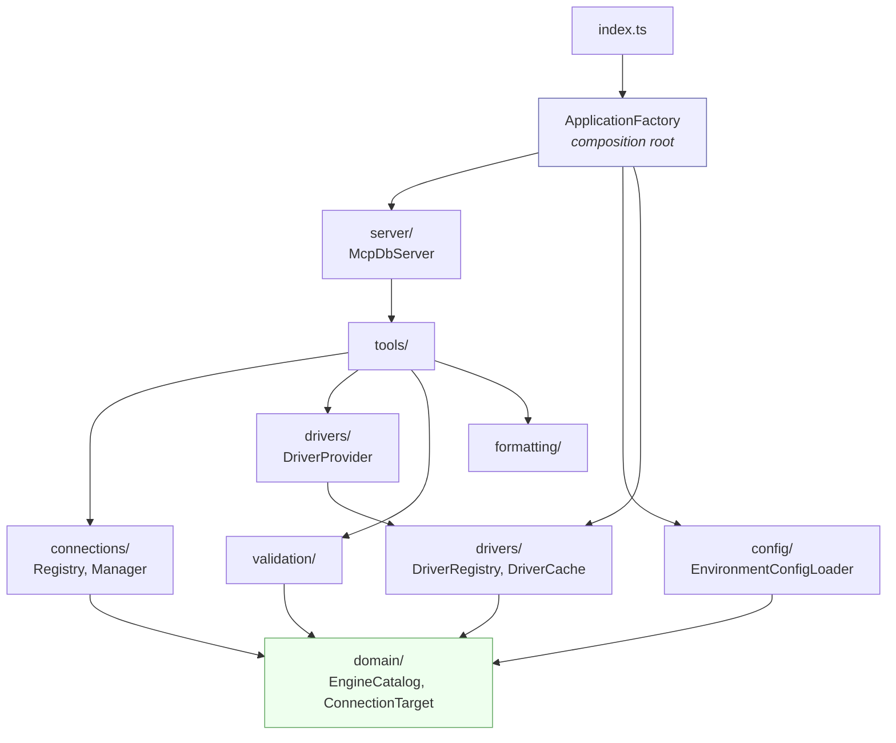

# Architecture

## Folder layout

```
src/
  index.ts                  Entry point: construct and start, nothing else
  ApplicationFactory.ts     Composition root: the only file that wires things

  types/                    Interfaces and type aliases, one file per concern
  errors/                   Named error classes
  domain/                   Engine catalog, ConnectionTarget, ConnectionProfile
  config/                   EnvironmentConfigLoader, PackageVersionLoader
  connections/              URL parser, target factory, registry, manager
  drivers/                  DatabaseDriver strategy, registry, cache, provider
    sql/                    MySQL, PostgreSQL, SQLite (+ worker), SQL Server, ClickHouse
    document/               MongoDB, stage allowlist, schema sampler
    keyvalue/               Redis, COMMAND INFO flags guard
    search/                 Elasticsearch and OpenSearch
  validation/
    sql/                    Dialects, skeletonizer, validator, rules/
    document/               MongoDB operator guard
    keyvalue/               Redis command allowlist
    search/                 Search body allowlist
    names/                  Per-engine naming policies
  formatting/               ToolResponse, RowFormatter, JsonSerializer
  tools/                    BaseTool, DatabaseScopedTool, and one folder per group
  server/                   McpDbServer
```



## Responsibilities

| Class | Responsibility | Holds state? |
| --- | --- | --- |
| `ApplicationFactory` | Build the object graph, register one driver factory per engine | No |
| `McpDbServer` | Register tools, run, shut down | Shutdown flag |
| `EnvironmentConfigLoader` | Read configuration, report problems | No |
| `EngineCatalog` | Static facts about each engine and scheme | No |
| `ConnectionUrlParser` | Turn a URL into target fields, for any engine | No |
| `ConnectionTargetFactory` | Build targets from URLs and legacy MySQL configuration | No |
| `ConnectionRegistry` | Known profiles, the active connection | **Yes** |
| `ConnectionManager` | Change the active connection safely | No |
| `DriverRegistry` | Which factory builds which engine's driver | Registered factories |
| `DriverCache` | One driver per connection, LRU | **Yes** |
| `DriverProvider` | Resolve a call's target and hand back a driver of the right family | No |
| Each driver | Talk to one engine, enforce its read-only layer two | Its lazily opened client |
| `ReadOnlyQueryValidator` | Decide if a SQL statement may run, per dialect | No |
| Other validators | The same, for MongoDB, Redis and search bodies | No |
| `BaseTool` subclasses | One tool each | No |

## Request flow

A `run_query` call against PostgreSQL:

```mermaid
sequenceDiagram
    autonumber
    participant C as MCP client
    participant T as RunQueryTool
    participant P as DriverProvider
    participant V as Validator (postgres)
    participant D as PostgresDriver
    participant S as PostgreSQL

    C->>T: tools/call run_query
    Note over T: BaseTool.invoke wraps<br/>everything in try/catch
    T->>P: requireActiveTarget, requireFamily("sql")
    P-->>T: target (or EngineMismatchError)
    T->>P: acquireSql(target)
    P-->>T: driver (cached, not yet connected)
    T->>V: validate(sql) with driver.dialect
    alt a rule objects
        V-->>T: invalid
        T-->>C: isError, no connection used
    else allowed
        T->>D: query(sql)
        D->>S: BEGIN READ ONLY; SET LOCAL ...
        D->>S: the statement, extended protocol
        S-->>D: rows
        D->>S: ROLLBACK
        D-->>T: rows
        T-->>C: text, truncated at 100 rows
    end
```

Acquiring a driver does no I/O, so a rejected query still costs no connection. The dialect comes from the driver, which is why validation happens after acquiring it.

## The one piece of mutable state

Two fields on `ConnectionRegistry`:

```ts
private activeName: string | null = null;
private activeTarget: ConnectionTarget | null = null;
```

Changing them changes where every subsequent call goes, including onto a different engine. There is no reconnect step: `DriverCache` keys its drivers by `ConnectionTarget.key()`, so pointing at a different database or server selects a different driver, and pointing back reuses the original.

### Why not `USE <database>`?

It looks simpler but makes a pool lie. A pool holds several connections and `USE` affects only the one it ran on, so a later query served by a different connection would silently read the old database. Keying drivers by target means every connection a driver opens was pointed at the right database from the start. It also generalises: PostgreSQL has no `USE` at all, since a database there is a connection parameter.

### Consequence: parallel calls race

The active connection is process-wide, so two concurrently handled tool calls share it. The mitigation is the optional `database` argument on every reading tool, which resolves its own target and ignores the shared state. Scoping the connection per request would need a session identifier MCP does not carry.

## Why every tool is always advertised

MCP fixes the tool list at handshake, while the active engine changes whenever the user switches. Hiding `run_query` while connected to MongoDB would mean the list is wrong the moment they switch back. So all eighteen tools are always listed, and a family-specific tool called against the wrong engine fails with `EngineMismatchError`, which names the tools that do fit.

## Why the composition root

Nothing constructs its own dependencies, which means nothing can be tested in isolation unless something assembles them. `ApplicationFactory` is that something, and keeping it to one file means the wiring is reviewable in one place. It is also the only file that names a concrete driver class, which is what keeps `connections/` and `tools/` free of engine knowledge.

## Why stdio and not HTTP

Stdio means the client owns the process lifetime, there is no port to bind, nothing to authenticate, and nothing is reachable from outside the machine. For a process holding database credentials, not listening on a socket is a feature. The cost is that stdout is sacred: it carries the JSON-RPC stream, so every diagnostic goes through the injected logger to stderr, and the SQLite worker process has its stdout disconnected entirely.
