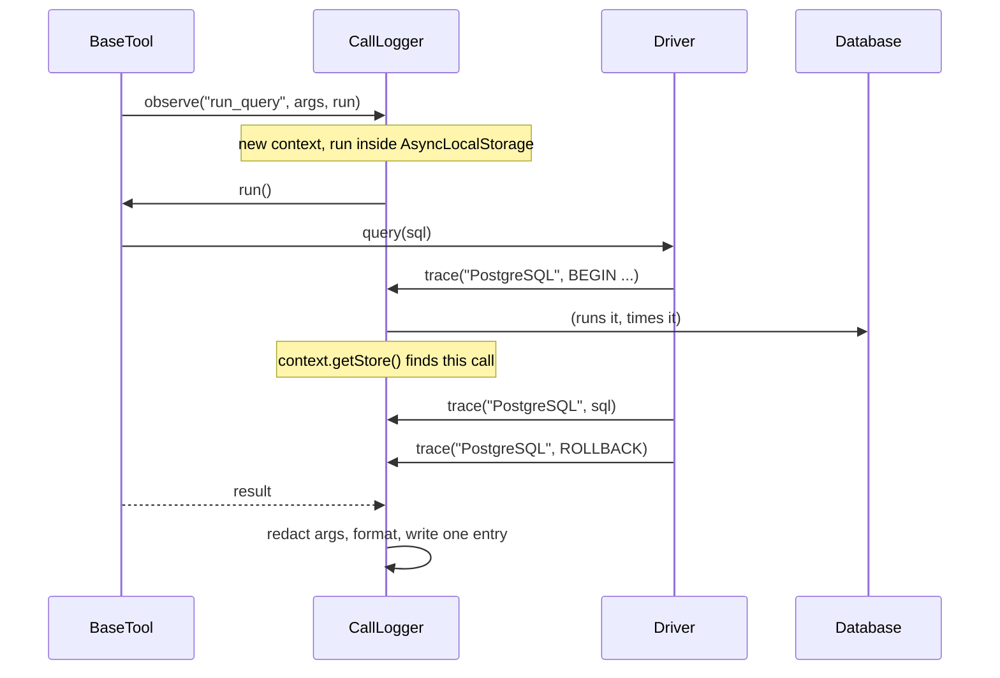

# Call Logging

An optional log of every tool call: its input, every statement the drivers sent to a database while serving it, and the full output. Off by default. The user-facing side (the environment variables and a sample entry) is in the README; this page is about how it works.

## The pieces

`src/logging/`:

| Class | Role |
| --- | --- |
| `ToolCallObserver` | What `BaseTool` hands each call to. `SilentObserver` when logging is off |
| `StatementTracer` | What drivers report each statement to. `SilentTracer` when logging is off |
| `CallLogger` | Implements both; ties statements to calls; writes entries |
| `Redactor` | Removes credentials from arguments before anything is written |
| `PrettyLogFormatter`, `JsonLogFormatter` | Turn a record into text |
| `LogChannel`, `TextLogChannel` | One output for records; the text one formats and writes to a sink |
| `StderrSink`, `FileSink` | Where the text goes |
| `FolderLogChannel` | Saves each entry as its own JSON file in `DB_LOG_DIR` |
| `LogStore`, `FolderLogStore`, `MemoryLogStore` | What the viewer reads: the folder (every copy's entries), or this process's recent entries in memory |
| `LogFileNames` | The file naming scheme, which carries everything the viewer lists and filters on |
| `RecordJson` | The one JSON shape of a record, shared by JSON lines, saved files and the viewer |
| `LiveLogViewer`, `LiveViewerObserver`, `ViewerAssets` | The optional browser viewer, the observer that starts it on first use, and its page |
| `LogRecords` | `CallRecord` and `StatementRecord`, the plain data both formatters render |

`ApplicationFactory.createCallLog` builds either one `CallLogger`, passed as the observer to the server and as the tracer to every driver, or the two silent stand-ins. Nothing else in the codebase knows whether logging is on.

`CallLogger` builds each record once, redacted, and hands the same object to every channel: always a `TextLogChannel` (stderr or file), and the `LiveLogViewer` when `DB_LOG_PORT` is set. A channel that fails is switched off on its own; the others carry on.

## How a statement finds its call

`observe` runs the call inside `AsyncLocalStorage`. A driver's `trace`, however many awaits beneath it, reads the store and appends to that call's statements. No call id is threaded through the drivers, and concurrently handled calls each keep their own list, because each runs in its own async context.

A statement with no store around it, typically MySQL's per-connection session setup, which the pool fires on its own schedule, is written as an entry of its own.

## Where it hooks in

**Tools.** `BaseTool.register` wraps `invoke` in `observer.observe`. The observer sees the call from outside `invoke`, so it gets the final result, error results included, and no tool can opt out, just as none can opt out of the error contract.

**Drivers.** `BaseDriver.traced(text, params, run, describe?)` is the one way a driver sends a statement. Every driver routes every statement through it: SQL text with its bound values, MongoDB operations as `db.collection.operation` with the filter or pipeline as parameters, Redis commands as the command line, Elasticsearch requests as `METHOD /path` with the body. The Redis read-only guard's `COMMAND INFO` lookups go through the same path, so the log shows the server being asked before a command is sent.

Callback-style code that cannot be wrapped in a promise reports after the fact with `tracer.record(...)`; `MySqlSessionInitializer` is the one user.

## Redaction

Always on, with no switch. `Redactor` replaces:

- any argument, at any depth, whose name matches the same pattern `ConnectionUrlParser` uses for secret URL options (`pass`, `secret`, `token`, `api_key`, `credential`);
- the password inside any string shaped like a connection URL, split exactly as the parser splits it, so what is masked is exactly what the parser would have used;
- secret-looking query parameters in such a URL.

Only the tool input is redacted. Statement text is written by the drivers, never contains credentials, and would be harmed by rewriting. Output never contains credentials, because `ConnectionTarget.describe()` excludes them by construction.

## Output

The full text returned to the client, however long; that was the requirement. Statement entries carry an outcome (a row count, an HTTP status, "ok", or the error) rather than their result data, since the data is already in the call's output directly above.

## Failure

A logger that throws would turn a working call into a broken one. So everything `CallLogger` does after the call has run is guarded: the first failure to format or write is reported once through the diagnostic logger, and logging switches itself off for the rest of the process. Failing silently on every call, or failing loudly on every call once a disk fills, were both worse.

## Why these choices

- **Synchronous file writes.** Shutdown ends with `process.exit`, which does not wait for a buffered stream, so an asynchronous writer lost the last calls of a session. A blocking append per call is small next to a database round trip.
- **stderr as the default destination.** The MCP client already keeps each server's stderr; Claude Code shows it in its MCP logs. Nothing is written to disk by the server unless a file is asked for.
- **File mode 0600.** With logging on, the file holds every query and every result.
- **ClickHouse's own client logging is switched off.** Its logger writes debug output with `console.debug`, which goes to stdout, the JSON-RPC stream. Every failure reaches the caller as an error anyway, and now as a statement in the call log.

## The live viewer

`LiveLogViewer` is a `LogChannel` and a `BackgroundService` (for shutdown). It binds its port on the **first tool call**, through `LiveViewerObserver`, a decorator around the call logger's observer that calls `ensureRunning()` before each call.

Binding at startup was the first design and it failed in real use: Claude Desktop started three copies of the server (two of its own, one for its embedded Claude Code), the first to start took the port, and the chat was talking to a different copy, so the page showed nothing. Binding on first use gives the port to the copy actually in use, and idle copies never hold one.

When the port is taken, `ensureRunning()` reports why, naming the holder via `lsof` where it exists. `LiveViewerObserver` appends one line to that call's result, once per process, telling the user to free the port or pick another, and logs it. Every later call retries the bind, cheaply, so freeing the port brings the viewer up on the next call, which is announced once with its URL. `current_connection` shows the viewer's state at any time.

It serves four read-only paths with Node's own `http`: `/`, `/viewer.js`, `/viewer.css` and `/events`. `/events` is Server-Sent Events: it replays `LogHistory` (the last `DB_LOG_HISTORY` entries, in memory only), sends `ready`, then pushes each new entry. Every entry is one `data:` line of compact JSON, which escapes the newlines inside strings, so no output can split an event or forge another one. Anything else is a 404, and anything but GET or HEAD a 405.

Decisions, and why:

- **Only alongside logging.** `DB_LOG_PORT` without `DB_LOG` or `DB_LOG_FILE` warns and starts nothing, as chosen when the feature was designed.
- **All interfaces, no access control**, also as chosen: the simplest thing that works from a Docker host and from another device. The server says so in its startup message, and the README and PRIVACY.md say so plainly. A token in the URL was considered and declined.
- **A taken port is reported, never fatal.** Another copy of the server in use by another chat is the usual cause, and this copy must still work as an MCP server.
- **It never keeps the process alive.** The listening socket and each connected page are unref'd. The process therefore lives exactly as long as it would without the viewer; otherwise a client that died without SIGTERM would leave an orphan holding the port.
- **Data is text, never markup.** The page builds every element with `textContent`. A row can contain `<script>`, and the page must show it, not run it. A unit test fails if the script ever uses `innerHTML`, `outerHTML`, `insertAdjacentHTML` or `document.write`. The Content-Security-Policy allows only the page's own script, stylesheet and event stream, as a second line.
- **Self-contained.** No framework, no CDN, no web font; a test checks the assets contain no external URL. The page is strings in `ViewerAssets.ts`, so `tsc` alone ships it in every distribution.
- **Reconnects without duplicates.** `EventSource` reconnects by itself after a restart, and the history replay would repeat entries, so the page skips any entry it has already shown.

## The log folder

`DB_LOG_DIR` adds a `FolderLogChannel`, which saves each entry as pretty JSON at `YYYY-MM-DD/HHMMSS-mmmZ_p<pid>_<c|s><sequence>_<tool>_<ok|failed>.json`:

- **A folder per UTC day**, so no folder grows unbounded and old days can be archived whole.
- **Everything the viewer filters on is in the name.** Paging, the tool filter and "failed only" read directory listings and never open a file; only a text search reads contents.
- **The pid and a per-process sequence** make every name unique, so any number of copies can share one folder.
- **Written to a temporary name, then renamed**, which is atomic, so no reader ever sees half a file. Temporaries end in `.tmp` and are ignored.
- **Owner-only permissions**, folder 0700 and files 0600.
- **Never deleted or rotated.** The folder is permanent by design.

With a folder, the viewer reads `FolderLogStore`: an index of file names built once, sorted newest first, then kept current two ways. This process's own writes arrive at once through `noteWritten`. Other copies' writes are found by listing today's folder once a second; `fs.watch` was avoided because it drops and duplicates events and behaves differently on network and bind-mounted folders. A file deleted by hand drops out of the index the next time it would be read.

This also mostly dissolves the one-port-many-copies problem: whichever copy owns the viewer shows every copy's calls.

## Pagination

`/api/entries?page=&size=&tool=&failed=1&q=` returns one page, newest first, with `total` and `pages`; `Paging` clamps the size to 1 to 100 and the page to the last one that exists, and both stores share it so they cannot disagree. The page offers 10, 20, 30 and 50, defaulting to 20, and remembers the choice in `localStorage`, guarded because storage can be unavailable.

The live stream only announces new entries; the page decides what to do. On page 1 it reloads that page, keeping open cards open. On any other page it shows a "new entries" button rather than shifting what the reader is looking at.

A unit test checks that every function the page script calls is defined in it. The script has no build step and the tests run no browser, and a refactor once removed a helper the live update depended on; the page failed silently until this check existed.

## The standalone viewer

`mcp-db-read-only viewer --dir <folder> [--port 4800] [--host 0.0.0.0]` (`src/cli/ViewerCommand.ts`) runs `LiveLogViewer` over a `FolderLogStore` and nothing else: no MCP server, no drivers, no credentials. `index.ts` loads it only for the `viewer` argument, so the MCP server's startup pays nothing for it.

It is the recommended way to watch the log. The copies of the server an MCP client starts then only write files, and none of them binds a port, so the question of which copy owns the viewer disappears. Its behaviour differs from the in-server viewer where a person is watching:

- It binds at once, and a taken port is a non-zero exit with the holder named, not a note in a chat.
- It holds its process open (`holdProcessOpen`), where the in-server viewer never keeps an MCP server alive.
- The folder is created if missing, owner-only, so it can be started before anything has been logged.
