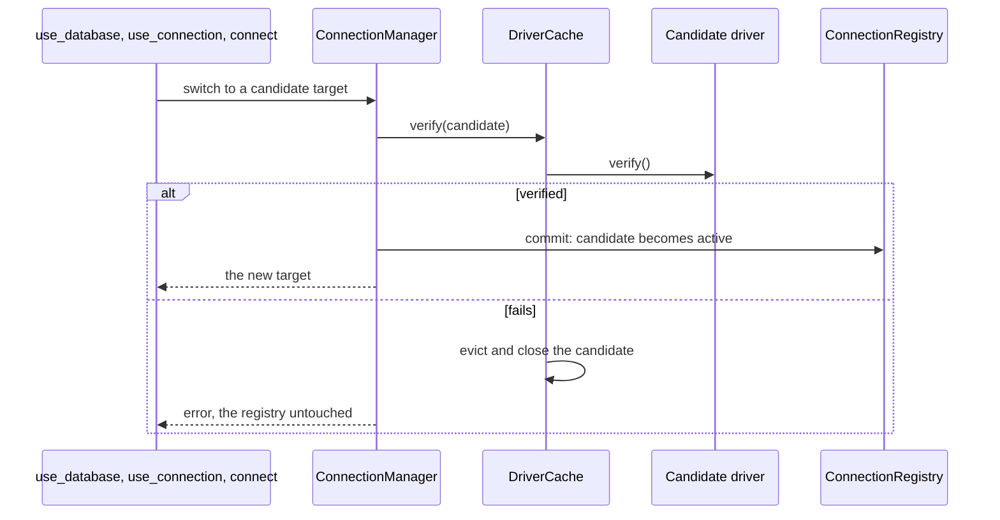

# Domain and Configuration

## `EngineCatalog`

A table of static facts about each engine (`src/domain/Engine.ts`): label, family, accepted URL schemes with their default ports and whether each is secure, whether the engine switches databases, its default database, what `list_tables` lists, and whether it accepts several hosts.

It is data rather than behaviour on the drivers because the connection layer needs these answers long before any driver exists: parsing a URL needs to know that `rediss` is Redis over TLS and that `mongodb+srv` takes no port, and `use_database` must refuse on SQLite without loading a SQLite driver to ask.

Two engines refuse database switching: a SQLite file is its own database, and an Elasticsearch cluster has none. `ConnectionManager.assertSwitchable` is the one place that refusal is worded, used by both `use_database` and the per-call `database` argument.

## `ConnectionTarget`

An immutable value object for one connection on any engine: engine, scheme, hosts, user, password, database, and two option maps. `options` are the URL's query parameters; `secretOptions` are the ones that look like credentials (`api_key`, `token`, `secret`, `password`...), split off at parse time so they can never reach a displayed string.

`key()` is identity and display at once: `postgres://reader@db:5432/app?sslmode=require`. It excludes the password and every secret option. `equals()` compares those too, which `DriverCache` uses to replace a cached driver when only the password changed.

`hosts` is a list because a MongoDB replica set is `mongodb://a:27017,b:27017/app`. Every other engine refuses more than one host at parse time, and reads `host` and `port`, which are the first entry.

## `ConnectionUrlParser`

Hand-written, because the WHATWG `URL` class throws on the comma-separated authority of a MongoDB replica set and has no reasonable reading of `sqlite:///path`. Since one engine needed a custom parser, every engine uses it, so credentials, ports and options follow one set of rules.

- The authority ends at the first `/`, `?` or `#`, as RFC 3986 says. The last `@` before that separates credentials from host, so an unencoded `@` in a password still works; a `/` or `#` does not, which is why a separate password field exists everywhere a URL is accepted.
- IPv6 hosts in brackets, ports checked to be 1 to 65535.
- SQLite: everything after `sqlite:` (and an optional `//`) up to `?` is the path, so `@` and `:` in a file name are not misread. `:memory:` is refused, since a read-only in-memory database is always empty.
- **No error ever contains the URL.** It is where the password usually lives, and these messages go to the log, the user and the model.

## `ConnectionTargetFactory`

Builds targets from the three shapes input arrives in: a URL (with an optional separate password), a legacy `MYSQL_PROFILES` entry, and the legacy `MYSQL_*` variables. A relative SQLite path is made absolute once, here, so the same file reached two ways is one connection. The legacy shapes keep the MySQL-only server's defaults, including `host.docker.internal` as the default host.

## `EnvironmentConfigLoader`

Reads, in order of precedence:

1. `DB_PROFILES`: `{"name": "url"}` or `{"name": {"url": "...", "password": "..."}}`.
2. `DB_URL`, with `DB_PASSWORD`, as the profile `default`.
3. `MYSQL_PROFILES`: the legacy object form. A name already defined above wins, with a warning.
4. `MYSQL_HOST`/`USER`/`PASSWORD`/`DATABASE` as `default`, unless something above claimed that name.

`DB_DEFAULT_PROFILE` falls back to `MYSQL_DEFAULT_PROFILE`, and the timeouts likewise.

Nothing here is fatal and nothing is logged: problems come back as `warnings`, which the composition root prints. A server that starts and explains the problem can be fixed with `connect`; one that exits during handshake looks like a broken install.

## `ConnectionRegistry` and `ConnectionManager`

Unchanged in shape from the MySQL-only server. The registry holds profiles and the active target and does no I/O. The manager is the only thing that changes the active target, and always **verifies, then commits**: the candidate's driver is opened and checked first, so a failed switch leaves the previous connection working. Switching across engines is an ordinary switch; nothing in either class knows what engine a target is.

Starting profile: the configured default if it exists, else `default`, else the first defined, else none.
