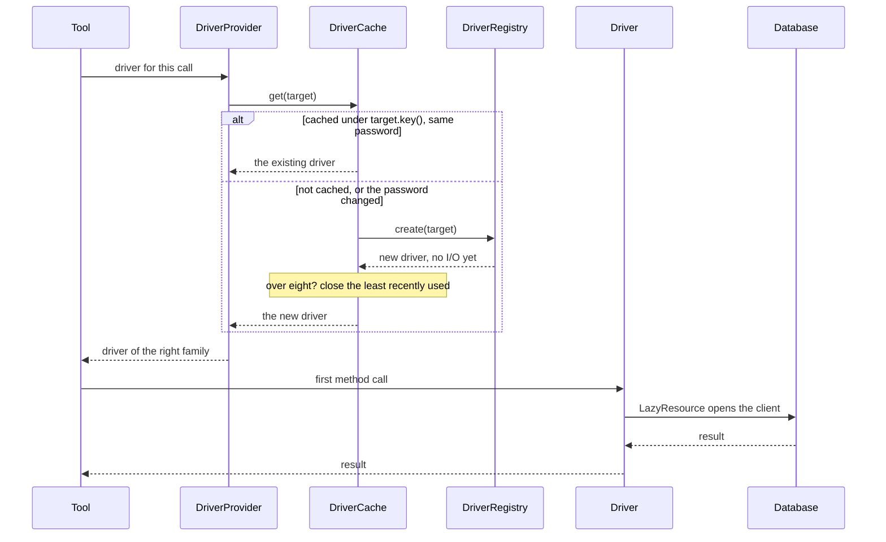

# Drivers

`src/drivers/` holds everything between a tool and a database.

## The pieces

| Class | Role |
| --- | --- |
| `DatabaseDriver` and family interfaces | The Strategy each engine implements |
| `BaseDriver` | Shared behaviour; refuses indexes and foreign keys by default |
| `LazyResource` | Opens a client on first use, forgets a failed open |
| `DriverRegistry` | Engine to factory, filled in by `ApplicationFactory` |
| `DriverCache` | One driver per connection, LRU, eight at most |
| `DriverProvider` | Resolves which target a call uses; hands back a driver of the right family |
| `GlobPattern` | The `pattern` of `list_tables`, applied in process where the engine cannot |

## Lifecycle of a driver

1. A tool asks `DriverProvider` for a driver. The provider resolves the target (active, or active with the per-call `database`) and asks `DriverCache`.
2. The cache returns the driver for that `key()`, or asks `DriverRegistry` to build one. **Building does no I/O.**
3. The driver's first method call opens its client through `LazyResource`, importing the engine's library at that moment. A server that only ever talks to PostgreSQL never loads the MongoDB driver.
4. `verify()` runs before any switch is committed. A driver that fails it is evicted and closed, so the next attempt starts clean.
5. Least recently used drivers are closed once more than eight are open, bounding sockets at eight times the per-driver connection limit (three).
6. `closeAll()` on SIGTERM closes every driver concurrently; closing never throws.

## Per engine

### MySQL and MariaDB: `MySqlDriver`

A mysql2 pool. `MySqlSessionInitializer` hooks the pool's `connection` event so every physical connection, including ones opened later as the pool grows, runs `SET SESSION TRANSACTION READ ONLY`, aligns `sql_mode` with the validator's lexing, and sets the statement timeout: `MAX_EXECUTION_TIME` on MySQL, `max_statement_time` on MariaDB, chosen by trying the first and falling back on error 1193. `dateStrings: true` keeps timestamps exactly as stored.

### PostgreSQL: `PostgresDriver`

A pg pool. Every statement runs as: `BEGIN TRANSACTION READ ONLY; SET LOCAL statement_timeout; SET LOCAL standard_conforming_strings = on` (one round trip), the statement in extended query mode, then `ROLLBACK`. A client whose rollback fails is destroyed rather than returned to the pool. Startup options (`-c default_transaction_read_only=on`) were the obvious alternative and were rejected because PgBouncer and most managed poolers refuse them. Date and time types come back as raw text, since parsing them into `Date` shifts every zone-less value by the host's offset.

Tables outside `public` are listed and addressed as `schema.table`.

### SQLite: `SqliteDriver` and `SqliteWorker`

`node:sqlite`, built into Node 22.13+, so no dependency and no native build. It is synchronous and cannot be interrupted from JavaScript, so the database lives in a **child process** that is killed with SIGKILL when a query passes the timeout, and replaced on the next call.

A worker thread was tried first and failed: `worker.terminate()` stops JavaScript, but a thread inside SQLite's native `sqlite3_step` never returns to JavaScript, so the terminate itself never finished and the server hung with it. The child's stdout is not connected, since this process's stdout is the JSON-RPC stream, and the child exits when the IPC channel closes, so a killed server leaves no orphan.

### SQL Server: `MsSqlDriver`

An mssql (tedious) pool. SQL Server has no read-only session, so every batch runs inside a transaction that is always rolled back. `applicationIntent=ReadOnly` is opt-in, because forcing it fails every connection to a primary that refuses read-intent connections. Encrypted by default, as tedious is.

### ClickHouse: `ClickHouseDriver`

The official HTTP client. On open, it asks the account's own `readonly` level with no settings attached, then sends with every query only what that account permits: `readonly=2` plus a server-side timeout and a result-row cap for an unrestricted account, just the limits for `readonly=2`, nothing for `readonly=1` (which refuses any setting, and already refuses writes). Browse queries bind names with `{name:Identifier}` parameters.

### MongoDB: `MongoDriver`

The official driver. The URL is rebuilt without credentials, which go through `auth`, so a password never has to survive re-encoding. Filters and pipelines arrive as Extended JSON and results leave as relaxed Extended JSON, so an ObjectId survives the round trip into a follow-up filter. `aggregate` reads at most `limit + 1` documents and closes the cursor. `describe_table` infers fields from a `$sample` of 100 documents with `MongoSchemaSampler`, reporting types and presence percentages, plus any declared JSON Schema validator.

### Redis: `RedisDriver`

ioredis, connecting lazily, failing commands fast while disconnected (`maxRetriesPerRequest: 1`) so a dead server reads as an error rather than a hang. Keys stand in for tables: `list_tables` uses `SCAN` with the glob, never `KEYS`; `describe_table` reports type, TTL, length, encoding and memory; `get_table_sample` reads a bounded slice with the command fitting the type. `redis_command` goes through `RedisCommandFlagsGuard`.

### Elasticsearch and OpenSearch: `ElasticsearchDriver`

Node's `fetch`, no client library: each vendor's official client refuses to talk to the other's server, and five read calls need no client. Basic auth from the URL, or `?api_key=`. Every request is a member of a closed union; see [Read Only Enforcement](Read-Only-Enforcement). A 404 on an index becomes `ObjectNotFoundError`; other errors carry the server's own `type: reason`.
