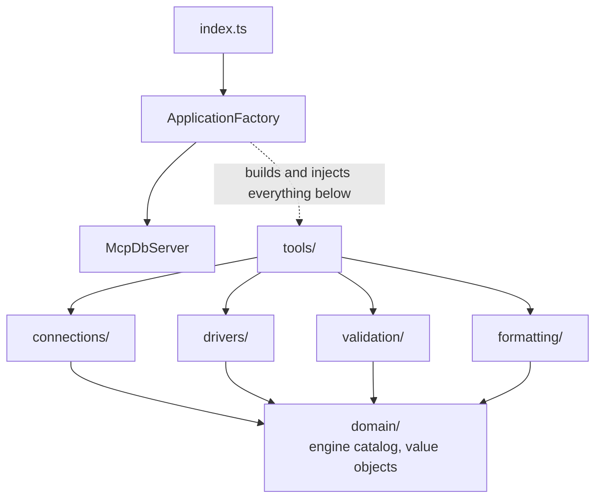

# mcp-db-read-only

A read-only MCP server that lets your AI assistant look at MySQL, MariaDB, PostgreSQL, SQLite, SQL Server, ClickHouse, MongoDB, Redis, Elasticsearch and OpenSearch, without being able to change anything.

## User guide

Start here if you want to use the server.

| Page | Covers |
| --- | --- |
| [Getting Started](Getting-Started) | From nothing to your first question, in about five minutes |
| [Databases](Databases) | Connection URLs, read-only accounts and examples for every database |
| [Using the Tools](Using-the-Tools) | All 18 tools: what each does and what to ask for |
| [Configuration](Configuration) | Every setting, several databases, coming from mcp-mysql-read-only |
| [Logging and Viewer](Logging-and-Viewer) | Saving every query to a folder, and watching them live in the browser |
| [Docker](Docker) | Running the server and the viewer in Docker |
| [Troubleshooting](Troubleshooting) | Common problems and their fixes |

## Developer guide

For people changing the code. Every page explains not just what a class does but why it is shaped that way. Many of the non-obvious decisions exist to close a specific failure found in testing, either here or in [mcp-mysql-read-only](https://github.com/shibbirweb/mcp-mysql-read-only), the MySQL-only server this one generalises.

| Page | Covers |
| --- | --- |
| [Architecture](Architecture) | Layers, request flow, the one piece of mutable state |
| [Design Patterns](Design-Patterns) | Which patterns are used, where, and what each one bought |
| [Domain and Configuration](Domain-and-Configuration) | The engine catalog, targets, URL parsing, the config loader, the registry |
| [Drivers](Drivers) | The driver strategy, lazy opening, the LRU cache, each engine's driver |
| [Read Only Enforcement](Read-Only-Enforcement) | Both layers, for every engine, and why each is shaped as it is |
| [Tools internals](Tools) | The tool class hierarchy and how tools are built |
| [Call Logging internals](Call-Logging) | How calls and statements meet, redaction, formats, the log folder and the viewer |
| [Server Lifecycle](Server-Lifecycle) | Composition root, startup, shutdown, the stdin EOF trap |
| [Testing](Testing) | Suite layout, the shared engine suite, running without local databases |
| [Release Process](Release-Process) | CI, Docker Hub, npm and MCP Registry publishing, the wiki |

## The one-paragraph summary

The server speaks MCP over stdio. `ApplicationFactory` is the composition root: it reads configuration, builds every collaborator and hands a finished `McpDbServer` back. A `ConnectionRegistry` holds the profiles and the single active connection, and a `ConnectionManager` is the only thing allowed to change it. Every engine is a `DatabaseDriver` strategy, built by a `DriverRegistry` and cached one per distinct connection by `DriverCache`, so switching selects a different driver rather than reconnecting. Each tool is its own class deriving from `BaseTool`; the browse tools work on every engine through the common driver interface, and each engine family has its own query tools. Every engine is read-only in two independent layers.

## Layers

Dependencies point inward. `domain/` imports nothing of ours; `validation/` and `formatting/` import only types and the domain; `tools/` never constructs a collaborator; only `ApplicationFactory` names a concrete driver.

## Guiding principles

**Everything is injected, nothing is a singleton.** No class reads `process.env` or constructs its own dependencies, so every one can be unit tested with a fake.

**Failures are tool errors, never crashes.** A bad query, a dead host, an unknown database, the wrong engine for a tool: all return `isError: true` with a readable message naming the fix. `BaseTool` enforces this so no handler can forget it.

**Never throw at import time, and never load what is not used.** A misconfigured environment produces a running server that explains the problem. Each driver imports its client library on first use, so a session that only ever talks to PostgreSQL never loads the MongoDB driver.

**Validate before interpolating, and escape anyway.** Names reaching a quoted identifier pass a strict allowlist first, and are escaped as they are quoted, so either protection alone is enough.

**Assume the validator will eventually be wrong.** Every engine has a second read-only layer that does not depend on the first, enforced by the database server itself wherever the engine offers a way.
