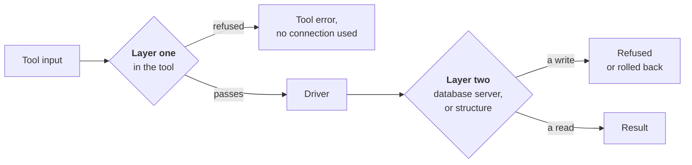
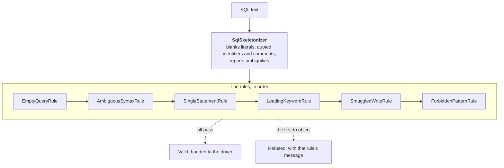
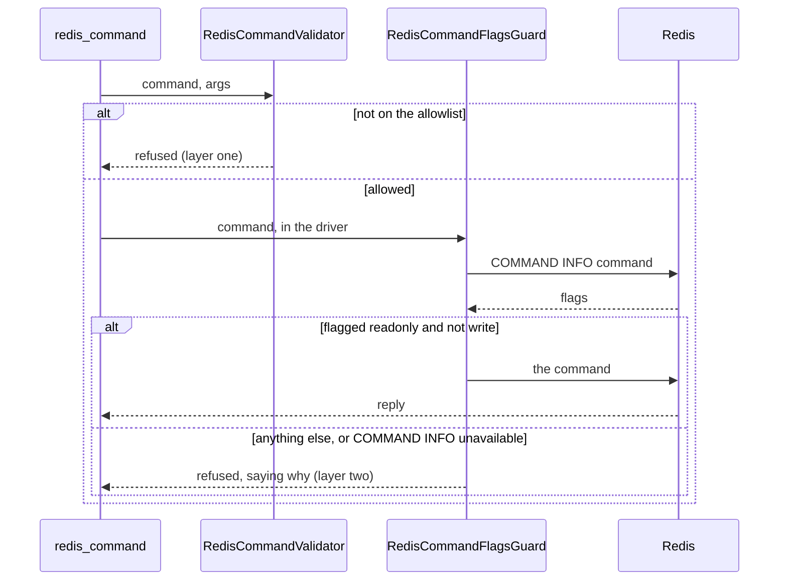

# Read Only Enforcement

Every engine is kept read-only by two independent layers. **Layer one** runs in the tools, before a driver is touched, so a rejected call costs no connection. **Layer two** runs in the driver, and is enforced by the database server itself wherever the engine offers a way. The layers are independent on purpose: a bug in either one alone must not become a write.

| Engine | Layer one | Layer two | Proved by |
| --- | --- | --- | --- |
| MySQL, MariaDB | SQL validator (`mysql` dialect) | `SET SESSION TRANSACTION READ ONLY` per connection; `multipleStatements: false` | a write sent to `MySqlDriver.query` fails with error 1792 |
| PostgreSQL | SQL validator (`postgres`) | `BEGIN TRANSACTION READ ONLY` ... `ROLLBACK` around every statement; extended protocol | a write fails; a smuggled `set_config` is rolled back |
| SQLite | SQL validator (`sqlite`) | File opened with SQLite's `readOnly` flag; extensions off | a write fails even after `PRAGMA query_only = OFF` |
| SQL Server | SQL validator (`mssql`), scanning every statement | Every batch inside a transaction that is always rolled back | an INSERT and a DELETE run, and leave nothing behind |
| ClickHouse | SQL validator (`clickhouse`) | `readonly=2` on every query | INSERT and DROP fail with ClickHouse's readonly error |
| MongoDB | `MongoOperatorGuard`: denylist of operators, any depth | `MongoStageAllowlist`: allowlist of stages; driver calls read operations only | `$out` sent to the driver is refused, and no collection appears |
| Redis | `RedisCommandValidator`: allowlist | `RedisCommandFlagsGuard`: the server's own `COMMAND INFO` flags | `SET` sent to the driver is refused, and the key is unchanged |
| Elasticsearch | `SearchBodyValidator`, `ElasticNamePolicy` | A closed union of read requests; no generic request method | unit tests on every path the driver can build |

The rightmost column matters. Each integration fixture sends a write **straight to the driver**, bypassing every validator, and asserts the server refused or undid it. Without that test, "two layers" would be a claim about code nobody had exercised.

## The SQL validator

`ReadOnlyQueryValidator` is one class used with five dialects (`src/validation/sql/SqlDialect.ts`). The rules are the same everywhere; the dialect supplies the lexing rules and word lists.

### Step one: skeletonize, exactly as the server lexes

`SqlSkeletonizer` blanks every string literal, quoted identifier and comment, so no rule can mistake data for SQL. This only works if the skeletonizer agrees with the server about where each literal ends. **Every disagreement is an attack:** if the validator thinks a string runs on where the server thinks it has ended, the text between is hidden from the validator and executed by the server.

The cases this design exists for:

| Dialect | Construct | If lexed wrongly |
| --- | --- | --- |
| PostgreSQL | `'a\'` is a complete string (no backslash escapes) | a MySQL-style lexer would hide `; DELETE ...` after it |
| PostgreSQL | `E'a\''` does take backslash escapes | the reverse |
| PostgreSQL, ClickHouse | `$$ ... $$` and `$tag$ ... $tag$` quoting | a `'` inside would open a "string" swallowing a real statement |
| SQL Server, SQLite | `[bracketed]` identifiers | a `'` inside `[a'b]` would do the same |
| MySQL | `--` is a comment only when whitespace follows | `1--2` is arithmetic |
| MySQL, ClickHouse | `#` starts a comment | elsewhere it must stay visible |

To make the server's lexing a fact rather than an assumption, the drivers pin the settings that change it: PostgreSQL sets `standard_conforming_strings = on` in every transaction, and MySQL removes `NO_BACKSLASH_ESCAPES` and `ANSI_QUOTES` (and the combination modes that imply it) from `sql_mode` on every connection.

### Step two: refuse what cannot be read with certainty

Some constructs are read differently by different servers, or by the same server in different modes. The skeletonizer reports them as **ambiguities**, and `AmbiguousSyntaxRule` refuses the statement. It never guesses.

- **Nested block comments.** PostgreSQL, SQL Server and ClickHouse nest them; MySQL and SQLite do not. A guess either way hides whatever follows the inner `*/` on one of the two readings.
- **MySQL executable comments**, `/*! ... */` and `/*M! ... */`. MySQL *executes* their contents, so `SELECT 1 /*!50000 INTO OUTFILE '/tmp/x' */` writes a file while every rule sees only a comment. (The MySQL-only predecessor blanked these as comments. Its read-only session still refuses table writes, but not `INTO OUTFILE`, which is a gap worth closing there too.)
- **Backslashes inside ClickHouse quoted identifiers**, whose escaping rules are not pinned down firmly enough to bet on.

The cost is that a handful of unusual but legitimate statements are refused, with a message saying exactly what to remove.

### Step three: the rules

In order:

1. `EmptyQueryRule`: nothing left after blanking.
2. `AmbiguousSyntaxRule`: see above.
3. `SingleStatementRule`: any `;` left in the skeleton is a real separator. On most engines the driver also cannot send two statements, but on **SQLite this rule is the only thing preventing a half-run**: its `prepare` silently ignores everything after the first statement.
4. `LeadingKeywordRule`: the dialect's read statements only. SQL Server allows just `SELECT` and `WITH`; PostgreSQL adds `SHOW`, `EXPLAIN`, `VALUES` and `TABLE`; and so on.
5. `SmuggledWriteRule`: scans for write keywords where a read opening can still carry a write: `WITH` (data-modifying CTEs), `EXPLAIN ANALYZE` (which executes in MySQL and PostgreSQL), and, **on SQL Server, every statement**, because T-SQL needs no separator: `SELECT 1 DROP TABLE t` is two statements. Elsewhere plain `SELECT` is not scanned, since columns named `start`, `begin` or `comment` are common and a SELECT cannot become a write there.
6. `ForbiddenPatternRule`: functions that do harm from inside a read, per dialect:
   - writing files: MySQL `INTO OUTFILE`, PostgreSQL `lo_export`, SQLite `writefile`
   - creating tables: `SELECT ... INTO` in PostgreSQL and SQL Server
   - reaching other servers: SQL Server `OPENROWSET` and `OPENQUERY`, ClickHouse `url()`, `s3()`, `file()`, `remote()`, `executable()`
   - **running SQL hidden inside a string literal**, which the skeleton blanks and no rule can see: PostgreSQL `dblink`, `query_to_xml`, `ts_stat`, `crosstab`. `dblink` also runs its SQL on a separate connection that the read-only transaction does not cover.
   - changing server or session state: `set_config`, `pg_terminate_backend`, `pg_reload_conf`
   - hanging the conversation: `SLEEP`, `BENCHMARK`, `pg_sleep`, ClickHouse `sleep`

Each pattern matches a function call or fixed phrase, never a bare word, so a column named `url` or `file` is fine.

## MongoDB

MongoDB has no read-only session mode, so layer two is structural, and deliberately a different mechanism from layer one:

- **Layer one, `MongoOperatorGuard`**, is a *denylist of operators*, walked recursively through filters and pipelines: `$out`, `$merge`, `$function`, `$accumulator`, `$where`, `$changeStream`. Depth is capped, so a hostile document nested ten thousand levels deep cannot exhaust the stack.
- **Layer two, `MongoStageAllowlist`**, is an *allowlist of stages*, checked inside `MongoDriver.aggregate`, including the nested pipelines of `$facet`, `$lookup` and `$unionWith`. A stage it has never heard of is refused, which is what catches a write stage added by a future server version.

Beyond that, the driver only ever calls `find`, `aggregate`, `countDocuments`, `distinct`, the list commands and `ping`. The README says plainly that the real server-side protection on MongoDB is a user with only the `read` role.

## Redis

- **Layer one, `RedisCommandValidator`**, is an allowlist. Deliberately excluded: `KEYS` (blocks the server; `SCAN` is the answer), `CONFIG GET` (returns `requirepass`), `PFCOUNT` (flagged as a write, since it updates a cached cardinality), `SORT` (can `STORE`; `SORT_RO` is allowed), blocking reads. Container commands are allowed per subcommand: `OBJECT ENCODING` yes, anything unlisted no.
- **Layer two, `RedisCommandFlagsGuard`**, asks the server. `COMMAND INFO` reports each command's flags; a command is sent only if the server flags it `readonly` and not `write`. This is the server's own classification, entirely independent of the list written here. It **fails closed**: if `COMMAND` is renamed, disabled or denied by an ACL, the command is refused with a message saying why, rather than sent on the strength of the allowlist alone.

The browse tools on Redis use fixed read commands chosen in the driver (`SCAN`, `TYPE`, `TTL`, `HSCAN`, `LRANGE`...), so they do not go through the guard.

## Elasticsearch and OpenSearch

The search API cannot write whatever its body says, so the concern is steering a request somewhere other than `_search`:

- **`ElasticNamePolicy`** refuses index names that would repoint the URL: `.` and anything with `..` (normalised away by the URL parser), and anything starting with `_` (an API, not an index). The name is percent-encoded on top.
- **`SearchBodyValidator`** allows only known top-level search keys, refusing `scroll` and `pit`, which open server-side contexts that outlive the call.
- **`ElasticsearchDriver`** has no generic request method. Every request it can make is a member of the closed `ReadRequest` union: `GET /`, `GET /_cat/indices/...`, `GET /<index>/_mapping`, `POST /<index>/_search`. Paths are built in one method, from validated names.

## Identifiers

Tool arguments naming a table or database are checked by the engine's `NamePolicy` before any driver is touched. On SQL engines this is a strict allowlist (`[A-Za-z0-9_$-]`, optionally `schema.table`), and drivers additionally escape every identifier as they quote it (doubling the quote character), so either protection is enough alone. Wherever the engine allows, names are bound as parameters rather than quoted at all: PostgreSQL's and SQL Server's catalog queries, SQLite's pragma functions, ClickHouse's `{name:Identifier}` parameters.

Hyphens are allowed where the MySQL-only predecessor refused them: every identifier is now escaped, and database names such as `my-app` are common on PostgreSQL and SQL Server.

## What this is not

A guard, not a permission system. It stops an assistant from writing through *this* server; it does nothing about the same credentials used elsewhere. The README's advice to connect with read-only accounts is the real protection, and on MongoDB and Elasticsearch it is the only server-side one.
