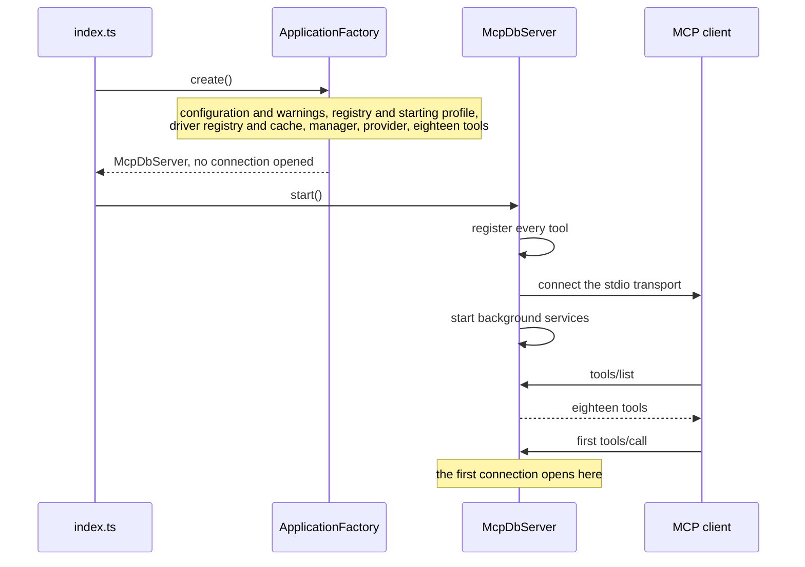
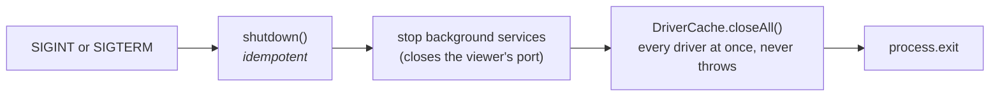

# Server Lifecycle

## Startup

`index.ts` constructs `ApplicationFactory` and starts what it returns. Nothing else, and in particular no configuration check and no exit path.

`ApplicationFactory.create()`:

1. Loads configuration and prints its warnings to stderr.
2. Builds the registry and selects the starting profile, printing a warning if the configured default does not exist, then the active connection (or "no connection configured").
3. Builds the driver registry, one factory per engine, and the driver cache around it.
4. Builds the manager, the provider and the eighteen tools.
5. Returns an `McpDbServer` with the version read from `package.json`.

No connection is opened at startup. The first tool that needs one opens it, which means a server whose database is down still starts, lists its tools, and explains the failure when asked.

`McpDbServer.start()` registers every tool before connecting the transport, so a `tools/list` arriving straight after the handshake can be answered. Background services, currently only the optional live log viewer, start after the transport, and one that fails to start reports it and is skipped.

## Why the server never exits on bad configuration

An MCP client cannot show the stderr of a process that exited during the handshake. It reports "server failed to start", which is indistinguishable from a wrong path or a broken image. A running server that says "call connect" is diagnosable, and usually fixable in the same conversation.

## Shutdown

SIGINT and SIGTERM call `shutdown()`, which is idempotent, stops the background services (closing the viewer's port), closes every driver concurrently through `DriverCache.closeAll()`, and exits. Closing never throws, so one unreachable server cannot stall shutdown. The SQLite worker processes are killed with it, and each also exits by itself when its IPC channel closes, so even a SIGKILLed server leaves no orphan.

## The stdin EOF trap

Once a driver has opened sockets, the event loop stays alive, so the process cannot exit on its own. That makes it tempting to shut down when stdin closes. The MySQL-only predecessor tried it and reverted it: stdin `end` fires when no further requests are *buffered*, not when the client has gone. A client that writes several requests and waits reaches EOF while they are still being processed, so connections were torn down mid-flight and every later call failed.

SIGTERM is what a client sends when it is genuinely finished. Test harnesses and CI smoke tests therefore end the server with a signal or `timeout`, never by closing stdin and waiting.

## stdout

stdout carries JSON-RPC only. Every diagnostic goes through the injected logger to stderr, including driver connection errors (ioredis, for instance, would otherwise print its own). The SQLite worker is started with its stdout not connected at all.
