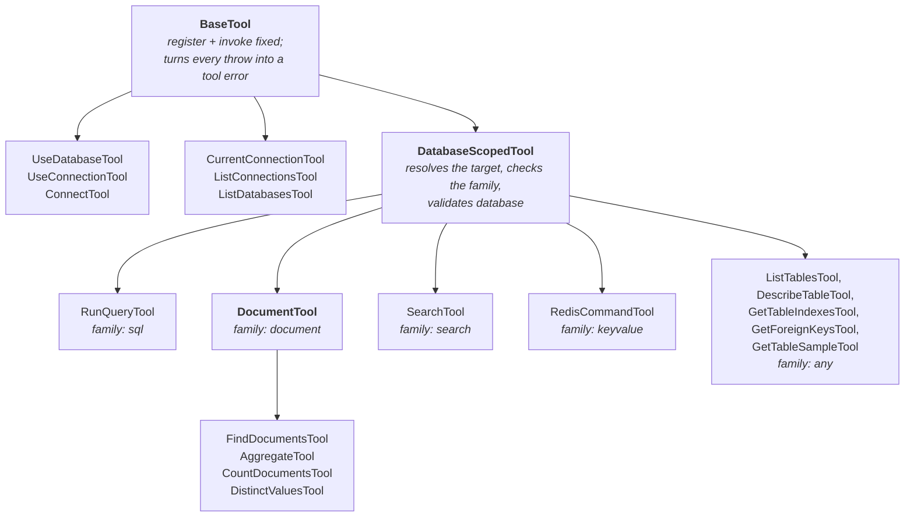

# Tools

## Hierarchy

`family` is a field on `DatabaseScopedTool`, null for the browse tools. A query tool called against the wrong engine throws `EngineMismatchError` before anything is acquired, and the message lists the tools that fit, taken from `QUERY_TOOLS` in `src/tools/QueryTools.ts`.

## Annotations

Every tool declares a `title` and all four hints in its own file, typed `ToolHints`, which makes an omission a compile error. There is no default in `BaseTool`; see the comment there for the directory-scanner history behind that.

The fifteen reading tools are `readOnlyHint: true`. `use_database`, `use_connection` and `connect` are `readOnlyHint: false`, because they change where the session points, and `destructiveHint: false`, because they change nothing in any database. All are `openWorldHint: true`, since answers come from servers this process does not control.

## Descriptions

Written for a model, not a person. Each says what the tool does, in each engine's terms where that differs ("collections on MongoDB, keys on Redis"), and stops. No instructions about unrelated actions, nothing that steers beyond choosing the right tool. `PRIVACY.md` makes that a public claim, so a description change is a policy change.

## Connection tools

| Tool | Notes |
| --- | --- |
| `current_connection` | Engine, profile and target; no error when nothing is configured |
| `list_connections` | Each profile's origin (`env` or `session`) and engine |
| `list_databases` | `include_system` shows `information_schema`, pg templates, MongoDB `admin` and so on. Refused on Elasticsearch |
| `use_database` | Validates with the *active* engine's name policy |
| `use_connection` | Validates the override with the *profile's* engine, which may differ from the active one |
| `connect` | A URL, an optional separate `password`, an optional `alias` |

## Browse tools

`list_tables` takes a glob `pattern`, applied by the server on Redis (`SCAN MATCH`) and Elasticsearch (the index pattern) and in process elsewhere, and caps at 1000 names, saying so when it does. The others take `table`, validated by the engine's name policy: a SQL identifier, a MongoDB collection, a Redis key, or an Elasticsearch index.

`get_table_sample` clamps `limit` to 1 to 50 in the handler as well as the schema, because some drivers interpolate it.

## Query tools

| Tool | Validation before the driver | Output |
| --- | --- | --- |
| `run_query` | The driver's dialect validator | Rows, truncated at 100 with the total stated |
| `find_documents` | Operator guard on filter, projection and sort | Documents as relaxed Extended JSON, limit 1 to 100 |
| `aggregate` | Operator guard on the pipeline | Up to 100 documents; says when there were more |
| `count_documents` | Operator guard on the filter | A sentence with the count |
| `distinct_values` | Operator guard on the filter | Values, truncated at 100 |
| `search` | Index name policy, body allowlist; `size` capped at 100 | Total, trimmed hits, aggregations |
| `redis_command` | Command allowlist | The reply as JSON |

`redis_command` takes the command name and its arguments separately, so an argument containing a space or a quote is never re-split and there is no command-line syntax to get wrong.

## Adding a tool

See `CLAUDE.md`. In short: one class per file, extend the right base, declare all annotations, set `family` for a query tool and add it to `QUERY_TOOLS`, register it in `ApplicationFactory`, and extend the handshake integration test's tool list.
